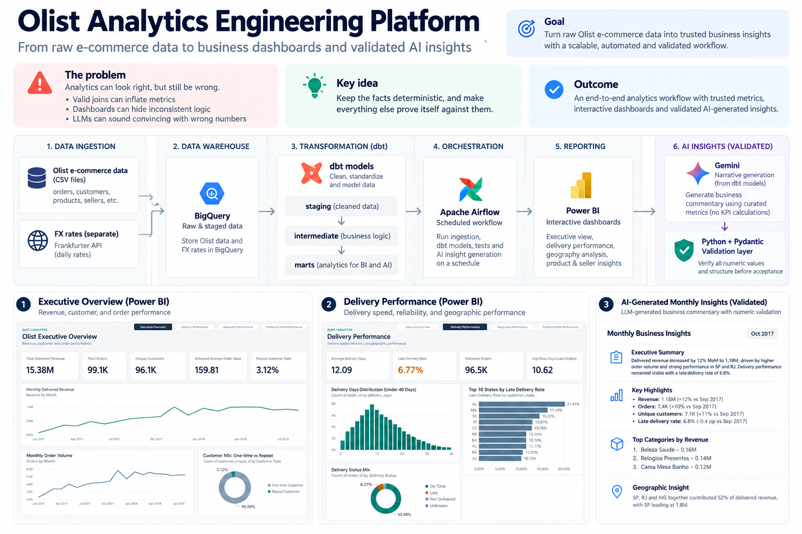
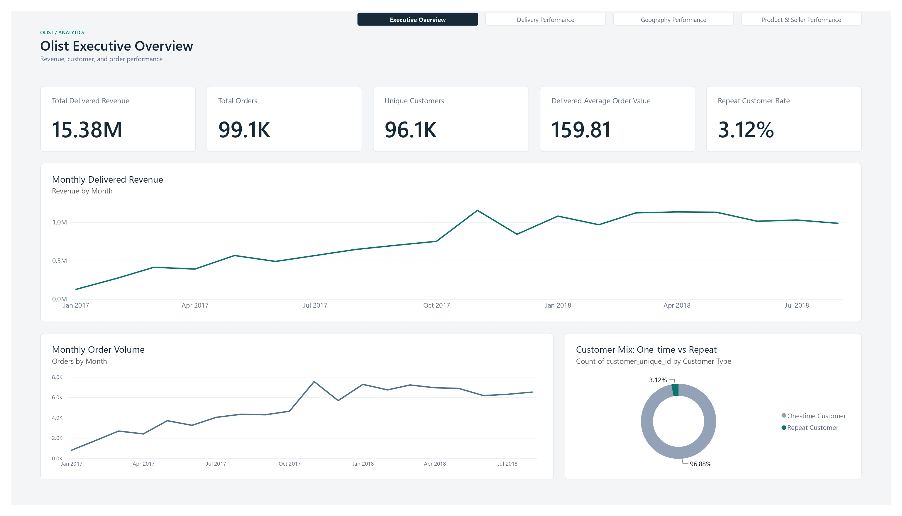
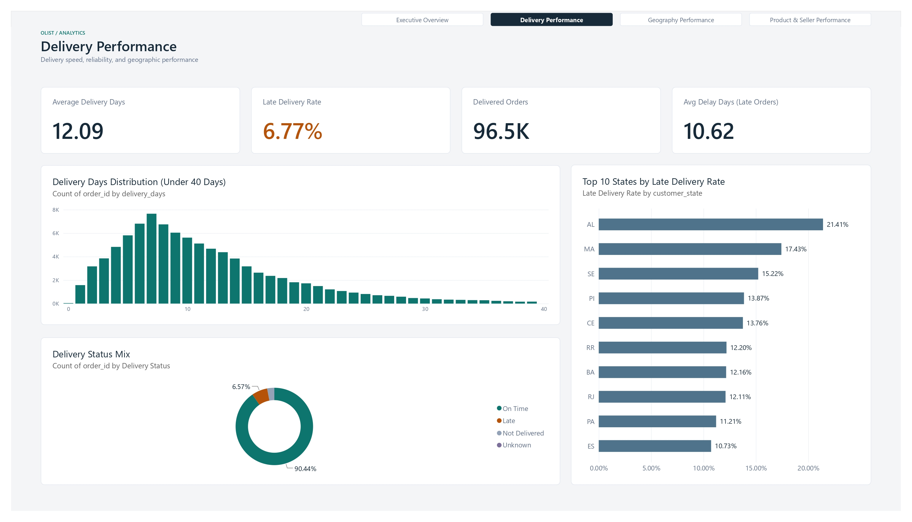
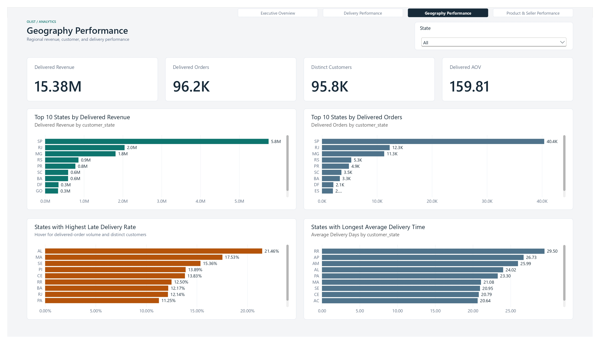
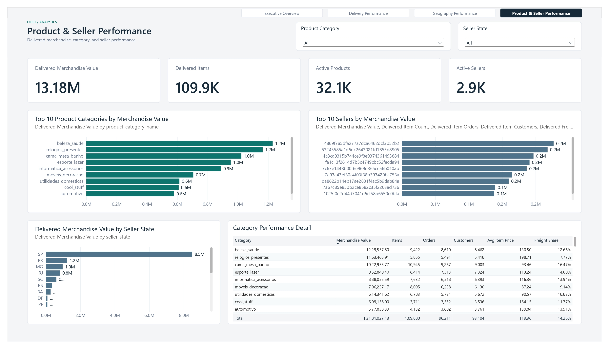

# Olist Analytics Engineering Platform

## Overview

An analytics engineering portfolio project using Python ingestion, BigQuery, and dbt analytical modelling to power an implemented Power BI dashboard and validated AI-generated monthly business insights. A separate Python pipeline ingests Frankfurter exchange rates. Airflow orchestrates FX ingestion, dbt execution and testing, and AI insight generation; Docker and GitHub Actions support local execution and validation.

This is a locally validated portfolio project, not a production deployment.

## Business questions

- How do order volume, delivered revenue, and average order value change by purchase month?
- Which customers place repeat orders, and what is their recorded spend?
- How long do deliveries take relative to estimated dates?
- How do payments reconcile with merchandise and freight totals?
- Which products and sellers contribute to individual orders?

## Architecture



The infographic highlights the analytics trust problem and the workflow: Olist ingestion into BigQuery, dbt staging/intermediate/mart layers, Airflow orchestration, Power BI reporting, and validated Gemini-generated insights, alongside separate FX ingestion.

Olist and FX are separate pipelines. FX rates are not used in Olist revenue calculations. Airflow sequences their execution; this does not imply a data dependency between FX and the Olist models.

## Data sources

- **Olist Brazilian e-commerce CSVs:** customers, orders, order items, payments, reviews, products, sellers, geolocation, and category translations. Place the original files in `data/raw/olist/`; expected filenames are defined in `ingestion/olist/load_olist_bigquery.py`. Data files are not committed. dbt currently uses customers, orders, order items, payments, products, and sellers.
- **Frankfurter REST API:** latest or historical exchange rates. Dated raw JSON files are saved under `data/raw/fx/`; warehouse rows include source and ingestion timestamps.

## Tech stack

| Technology | Role |
| --- | --- |
| Python 3.11, Requests, BigQuery client | Ingestion, validation, warehouse loading |
| BigQuery SQL | Analytical storage and transformations |
| dbt Core, dbt-bigquery, Jinja | Dependencies, materializations, macros, data tests |
| Power BI Desktop, PBIP/PBIR | Stakeholder-facing dashboard using the BigQuery/dbt analytical layer |
| Gemini / Google GenAI | Structured business commentary from trusted KPIs |
| Pydantic | Structured AI response validation |
| pytest | Ingestion, KPI retrieval, AI validation, and Airflow integration tests |
| Apache Airflow | External/local orchestration |
| Docker Compose | Local Python/dbt runtime |
| GitHub Actions | pytest and dbt parse on pushes and pull requests |

## Data flow

1. The Olist loader applies explicit schemas and replaces nine raw tables using `WRITE_TRUNCATE`.
2. Staging exposes source fields and standardizes selected names. Intermediate models enrich records and aggregate payments and items to order grain.
3. dbt marts calculate trusted business metrics and provide facts, dimensions, customer metrics, and monthly reporting datasets.
4. After dbt validation, Python fetches monthly reporting KPIs from BigQuery. Gemini generates narrative only; Pydantic checks the response structure and deterministic Python validation rejects unsupported numerical claims, including unsupported derived numbers. Validated JSON and Markdown reports are saved.
5. Separately, the Power BI dashboard imports the validated analytical tables from BigQuery for executive, delivery, geography, and product/seller reporting.
6. Independently, the FX runner validates API responses, saves raw JSON, and appends normalized currency rows. A date-level existence check skips previously loaded dates.

## dbt model architecture

| Layer | Count | Materialization |
| --- | --- | --- |
| Staging | 6 | Views |
| Intermediate | 4 | Views |
| Normal marts/reporting | 8 | Tables |
| Incremental demonstration | 1 | Incremental |

The project contains **19 models and 95 dbt data tests in total**. The validated non-incremental path contains **18 models and 91 tests**, all passed against BigQuery. The remaining model, `fct_orders_incremental`, is a demonstration; it and its four tests are intentionally excluded from normal orchestration and non-incremental validation. See [analytics documentation](analytics/README.md) for model grains and relationships.

## Key metrics and modeling decisions

- **Order grain:** payments and items are aggregated separately before joining orders, avoiding multiplication of payment totals across item rows.
- **Customer identity:** `customer_id` identifies an order-associated record; `customer_unique_id` groups repeat purchases. The customer dimension selects the latest order's attributes.
- **Monthly attribution:** KPIs are grouped by purchase month. Delivered metrics describe orders purchased in that month whose current status is delivered, not orders delivered during that calendar month.
- **Revenue and spend:** delivered revenue sums qualifying payments. Customer spend and average order value include all order statuses. Missing payments may remain null. These are payment-based measures, not profit.
- **Delivery:** facts calculate elapsed delivery days and delay relative to the estimated date.
- **Growth:** safe division and consecutive-month checks avoid misleading comparisons across gaps or zero denominators.
- **Reporting window:** January 2017 through August 2018 is chosen for stable reporting coverage. A broader monthly mart is also available.

## Power BI dashboard

The implemented report is stored as a Power BI Project (PBIP/PBIR) under [dashboard/](dashboard/), with [Data Analytics.pbip](dashboard/Data%20Analytics.pbip) as the project entry point. It connects in Import mode to the dbt/BigQuery analytical layer and uses validated marts, facts, and dimensions: `monthly_revenue_reporting`, `customer_metrics`, `fct_orders`, `fct_order_items`, `dim_products`, and `dim_sellers`.

### Dashboard preview









The report contains four stakeholder-facing pages with consistent page navigation:

- **Executive Overview:** delivered revenue, orders, customers, average order value, repeat customers, and monthly trends.
- **Delivery Performance:** delivery times, late-delivery rates, delay days, delivery status, and state comparisons.
- **Geography Performance:** state-level revenue, orders, customers, average order value, and delivery performance.
- **Product & Seller Performance:** merchandise value, items, products, sellers, and category/seller-state analysis.

[View the full four-page Power BI dashboard as PDF](docs/powerbi/olist-analytics-dashboard.pdf)

## AI-generated monthly insights

The workflow reads BigQuery/dbt monthly reporting KPIs from `monthly_revenue_reporting`. Python retrieves and formats the trusted metrics; Gemini produces structured stakeholder commentary without calculating new metrics.

From the repository root, generate the latest available reporting month or request a specific month:

```bash
python -m ai.generate_insights
python -m ai.generate_insights --month YYYY-MM
```

Pydantic enforces the response contract. A deterministic numeric validator rejects unsupported numbers, including fabricated or unsupported derived values, and retries generation once when numeric validation fails. The same validated response and KPI payload produce synchronized JSON and Markdown reports in `ai/outputs/`; generated files are excluded from version control.

The design principle is: **Warehouse / Python = facts and calculations; Gemini = narrative; Python validation = grounding gate.** Live execution requires BigQuery authentication, Google GenAI and Pydantic dependencies, and `GEMINI_API_KEY` in the environment.

## Airflow orchestration

The DAG is included at `orchestration/airflow/dags/fx_pipeline.py`. Airflow runs externally/locally, for example in WSL; it is not containerized in this repository.

The daily 07:00 schedule follows Airflow's configured timezone. Tasks retry twice with a one-minute delay and execute `run_fx_ingestion` -> `run_dbt_project` -> `test_dbt_project` -> `generate_ai_insights`. FX ingestion uses the logical date; the AI task runs after successful dbt tests and automatically selects the latest available reporting month. Both dbt commands exclude `fct_orders_incremental`. Olist raw tables must already exist; the DAG does not load the Olist CSVs.

Paths are configurable. See [Airflow setup](orchestration/airflow/README.md). DagBag/import validation passed, and a real full four-task DAG run completed successfully locally. The AI task automatically resolved the reporting month, generated validated insights, and saved JSON and Markdown outputs. This is local validation evidence, not a production deployment.

## Docker usage

From the repository root:

```bash
docker compose build
docker compose run --rm analytics
docker compose run --rm analytics dbt parse
docker compose run --rm analytics dbt debug
docker compose run --rm analytics dbt run --exclude fct_orders_incremental
docker compose run --rm analytics dbt test --select fct_order_items
docker compose run --rm analytics dbt test --exclude fct_orders_incremental
```

The default Compose command runs pytest from `/app`; explicit dbt commands run from `/app/analytics`. Rebuild after code or SQL edits because files are copied at image build time.

Compose mounts Windows host dbt and Google application-credential directories read-only using `USERPROFILE` and `APPDATA`. Adapt these mounts for other host operating systems. Credentials are not included in the image. Warehouse commands require external authentication and a dbt profile.

## Testing and CI

- **Python:** 70 tests passed, covering ingestion, monthly KPI retrieval, structured AI responses, numeric grounding and retry behavior, report synchronization, and Airflow integration.
- **dbt:** 95 data tests in total, covering nullability, uniqueness, accepted values, and relationships. The validated non-incremental path includes 91 tests; four tests belong to the excluded incremental demonstration.
- **GitHub Actions:** installs `requirements-docker.txt`, runs pytest, creates a temporary placeholder profile, and runs `dbt parse`. CI does not connect to BigQuery or execute warehouse data tests.

Parsing checks project structure and Jinja processing, not successful SQL execution in BigQuery.

## How to run locally

Use Python 3.11 with an activated virtual environment. From the repository root:

```bash
python -m pip install -r requirements-docker.txt
python -m pytest -v
```

`requirements-docker.txt` is the shared Docker/CI dependency set. `requirements.txt` records a broader development environment; it is not required in addition for these commands. Airflow requires a separate installation.

For warehouse execution, configure Google application authentication and an `analytics` dbt profile outside the repository. Ensure the raw dataset exists and the account can load raw tables and build the target dataset. The current local BigQuery project is `mda-platform-2026`; ingestion constants, dbt sources, and Compose reference it. Another project requires aligning those settings and the external profile. A profile change alone is insufficient.

After placing the Olist CSVs in `data/raw/olist/`:

```bash
python -m ingestion.olist.load_olist_bigquery
python -m ingestion.fx_api.run_fx_pipeline --date 2025-01-15
```

The Olist command replaces raw tables. The FX command is independent and optional for Olist analytics. From `analytics/`, with the profile in dbt's default location or a directory selected by `DBT_PROFILES_DIR`:

```bash
dbt parse
dbt run --exclude fct_orders_incremental
dbt test --exclude fct_orders_incremental
```

## Verified results

| Validation | Result |
| --- | --- |
| Python test suite | 70 passed |
| Non-incremental dbt validation against BigQuery | 18 of 19 models and 91 of 95 data tests passed; incremental demonstration excluded |
| `fct_order_items` against BigQuery | Table built successfully; approximately 112.7k rows; all 9 selected tests passed |
| dbt parse, including Compose execution | Passed |
| Airflow DAG | DagBag/import validation passed; full four-task local DAG execution completed successfully |
| AI insights | Structured response validation, numeric grounding, and retry behavior verified; a successful local run generated synchronized JSON and Markdown reports |

These are local validation results, not production deployment evidence or CI warehouse checks.

## Known limitations

- Warehouse identifiers are hardcoded; data acquisition and profile setup are manual.
- FX is separate from Olist analytics. Its duplicate-date check is not concurrency-safe and broadly catches check failures.
- The incremental demonstration does not reliably handle updates to older orders or late-arriving records.
- Reviews, geolocation, and category translations are loaded but not modeled downstream.
- Python tests do not provide end-to-end API/warehouse coverage; CI does not validate SQL execution against BigQuery.
- Power BI Service deployment and scheduled Power BI refresh are not configured in this repository.
- Production deployment is not implemented.
- Live AI generation requires Gemini API availability and credentials; narrative quality depends on the configured model/API. Numeric grounding validation does not prove full semantic correctness.

## Future improvements

- Parameterize warehouse configuration and improve setup portability.
- Add ingestion failure-path tests and stronger load reconciliation.
- Extend incremental processing for updates and late arrivals.
- Document stakeholder usage and report maintenance.
- Schedule delivery of generated reports, such as Slack/email delivery.
- Strengthen semantic validation and AI evaluation.
- Define production deployment, monitoring, observability, and refresh operations.
- Extend model and test coverage for additional source tables.

These are proposed improvements, not current capabilities.

## Repository structure

```text
ingestion/                  Python Olist and FX ingestion
analytics/
  models/staging/olist/      Source-facing models
  models/intermediate/      Enrichment and aggregation
  models/marts/             Facts, dimensions, metrics, reporting
  macros/                   Reusable growth calculation
ai/                        Validated AI insight generation and grounding logic
orchestration/airflow/       Portable DAG and external setup notes
dashboard/                  Power BI PBIP/PBIR report project
tests/                      Python tests
.github/workflows/ci.yml     Credential-free CI
Dockerfile                  Python/dbt image
compose.yaml                Local analytics service
requirements-docker.txt     Docker/CI dependencies
requirements.txt            Broader development dependency snapshot
```
