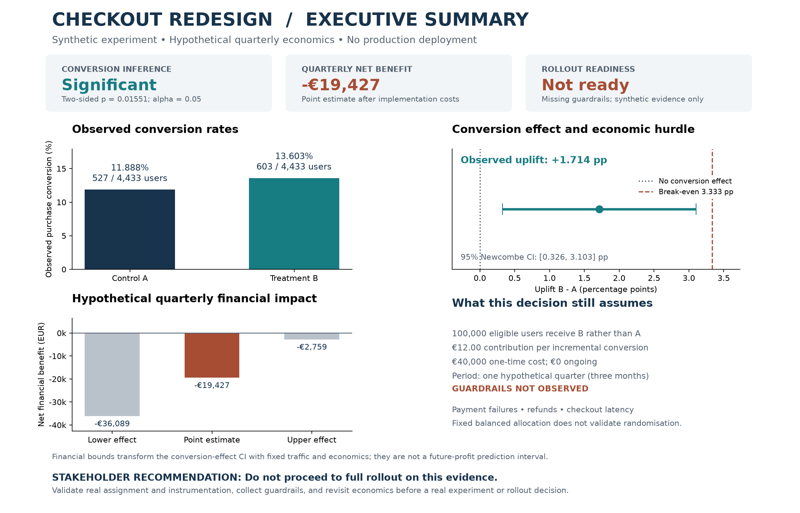

# A/B testing foundations

Read the [Checkout Redesign A/B Test — Synthetic Experiment Case Study](CASE_STUDY.md)
for the complete portfolio narrative, actual reproducible results, and final
technical review. This standalone module demonstrates sample-size planning,
conversion inference, allocation diagnostics, Monte Carlo calibration, and
conditional business decisions with missing guardrails. Its experiment data is
synthetic and its financial inputs are hypothetical; it does not describe a
real-company experiment or deployment.



Regenerate the documentation image without creating or modifying experiment CSVs:

```bash
python -m experimentation.executive_summary
```

The image is stored in `docs/images/checkout-ab-test-executive-summary.png`,
outside the ignored outputs directory, so GitHub can display it. Existing
calculations supply all experimental observations; [executive_summary.py](executive_summary.py)
only renders their results. Use `--output` to select another PNG path.

## Phase 1: sample-size planning

From the repository root, install the shared dependencies and run the default
example or provide conversion probabilities as fractions:

```bash
python -m pip install -r requirements-docker.txt
python -m experimentation.sample_size
python -m experimentation.sample_size --baseline 0.12 --treatment 0.14 --alpha 0.05 --power 0.80
python -m pytest -v
```

The default example requires **4,433 participants per group**, or **8,866 total**.
The target uplift is **2 percentage points**, or **16.6667% relative to baseline**.
The sample size is computed, not hardcoded.

For reuse in Python:

```python
from experimentation.sample_size import calculate_sample_size

result = calculate_sample_size(0.12, 0.14, alpha=0.05, power=0.80)
print(result.sample_size_per_group, result.total_sample_size)
```

## Method and assumptions

The calculator uses Cohen's h, the difference between the arcsine-square-root
transformed conversion rates, from
[proportion_effectsize](https://www.statsmodels.org/stable/generated/statsmodels.stats.proportion.proportion_effectsize.html).
It solves the normal-approximation power equation using
[NormalIndPower.solve_power](https://www.statsmodels.org/stable/generated/statsmodels.stats.power.NormalIndPower.solve_power.html),
with `alternative="two-sided"` and `ratio=1.0`. Each group is rounded up;
the total is twice that rounded count. A treatment decrease uses the same
absolute effect size but returns signed negative uplift.

Assumptions: independent Bernoulli outcomes, independent groups, equal random
allocation, stable baseline and treatment probabilities, a single prespecified
comparison, and a fixed sample horizon. Alpha is the two-sided type I error
rate; power is the probability of rejecting equal rates at the specified effect.

This is an approximate planning calculation, not an exact binomial guarantee.
Rare outcomes and small samples may make the normal approximation inaccurate.
There is no continuity correction, adjustment for multiple comparisons,
clustering, repeated looks, or participant attrition. The counts describe
analyzable participants, not traffic estimates or experiment duration.

All inputs must be finite real numbers strictly between 0 and 1. Boundary
conversion rates are excluded; in particular a zero baseline has undefined
relative uplift. Rates must differ, and power must exceed alpha for a positive
solution. Numerically indistinguishable effects, failed convergence, and invalid
solver results raise `ValueError`; the CLI reports these as argument errors.

The calculation is deterministic and needs no random seed, data files, external
services, or warehouse access. Statsmodels and its newly required SciPy/Patsy
dependencies are pinned in both dependency files for reproducibility.

## Phase 2: synthetic checkout redesign experiment

**All user records and outcomes in this module are synthetic.** This fictional
e-commerce experiment is an educational example, not an observation of actual
customers or evidence about an actual checkout redesign.

Generate the CSV, then analyze it from the repository root:

```bash
python -m experimentation.simulate_experiment
python -m experimentation.analyze_experiment
python -m pytest -v
python -m pip check
```

By default the simulator reuses the Phase 1 calculator to allocate **4,433 users
to A and 4,433 to B**. True generation probabilities are **0.12 for control A**
and **0.14 for treatment B**. A local NumPy `Generator(PCG64(42))` draws independent
Bernoulli outcomes with `binomial(1, p)`, first for all A users, then for all B
users. Unique IDs and variants are assigned deterministically. This is a fixed
equal allocation rather than independently randomized group counts.

The CSV has `user_id`, `variant` (`A` or `B`), and `converted` (numeric `0` or `1`).
It is written to `experimentation/outputs/synthetic_checkout_experiment.csv`;
the output directory is Git-ignored. Running generation again overwrites that
file with the same data for the same seed, arm size, and library versions. The
simulator does not modify NumPy's global random state. The tested environment
uses NumPy 2.4.6, pandas 3.0.6, Statsmodels 0.14.6, and SciPy 1.17.1; preserve
these versions when reproducing exact outcomes and numeric results. The shared
Docker/CI dependency file resolves NumPy and pandas transitively, while the
broader development requirements file pins their versions.

Optional CLI arguments support alternate seeds, equal arm sizes, and file paths:

```bash
python -m experimentation.simulate_experiment --seed 42 --users-per-group 4433 --output experimentation/outputs/synthetic_checkout_experiment.csv
python -m experimentation.analyze_experiment --input experimentation/outputs/synthetic_checkout_experiment.csv
```

For Python reuse:

```python
from experimentation.simulate_experiment import simulate_experiment
from experimentation.analyze_experiment import analyze_experiment, format_summary

data = simulate_experiment(seed=42)
result = analyze_experiment(data)
print(format_summary(result))
```

### Observed results and inference

The analyzer computes users, conversions, and **observed** conversion rates from
the CSV. Observed rates are random realizations; they need not equal the true
probabilities used by the simulator. It never substitutes generation
probabilities for observed rates or hardcodes a statistical result.

All effects are **treatment B minus control A**. Absolute uplift is
`100 * (observed_B - observed_A)` in percentage points. Relative uplift is
`100 * (observed_B - observed_A) / observed_A` as a percentage. A decrease has
negative uplift. Relative uplift is reported as undefined if observed A is zero.

The hypothesis test is Statsmodels'
[two-sided two-proportion z-test](https://www.statsmodels.org/stable/generated/statsmodels.stats.proportion.proportions_ztest.html)
of `H0: p_B = p_A` against `H1: p_B != p_A`, using the pooled observed rate under
the null. B's counts are passed first so the z-statistic has the B-minus-A sign.
Statistical significance is determined from the unrounded p-value at
`p < 0.05`, not from the displayed rounding.

The **95% interval for p_B - p_A** uses
[Newcombe's method](https://www.statsmodels.org/stable/generated/statsmodels.stats.proportion.confint_proportions_2indep.html)
(`method="newcomb"`, `compare="diff"`, `alpha=0.05`), combining separate Wilson
score intervals. This has better boundary behavior than a simple Wald interval.
The result object stores probability units; the terminal also reports the bounds
in percentage points. It is not an exact binomial interval or an inversion of
the pooled z-test, so the interval's exclusion of zero and the test decision can
differ near the significance threshold. A confidence interval describes the
long-run coverage of the method, not a 95% probability assigned to the fixed
true effect.

Before analysis, validation rejects missing columns or values, duplicate user
IDs (including users appearing in both arms), blank IDs, invalid variants,
nonbinary conversion outcomes, and empty groups. The analyzer accepts unequal
non-empty group sizes and uses the actual counts, though the specified
simulation has equal arms. If every outcome in both groups is zero or every
outcome is one, the pooled z-test has zero variance; its statistic, p-value, and
significance decision are explicitly reported as undefined. The Newcombe
interval is still computed.

### Assumptions and limitations

Inference assumes independent users, one Bernoulli observation per user,
independent groups, stable conversion probabilities, a fixed sample horizon,
and one prespecified comparison. Unique IDs do not prove independence or valid
random assignment in a real experiment. The z-test uses a normal approximation;
the summary flags fewer than five observed conversions or non-conversions in
either arm as a rough warning, not a guarantee of validity.

There is no continuity correction or adjustment for repeated looks, clustering,
multiple comparisons, attrition, or sample-ratio mismatch. Phase 1 uses an
arcsine effect-size power approximation while this phase tests pooled observed
proportions; planning power is approximate and does not guarantee a significant
result in any one simulation. A significant result does not automatically
justify launch, and a nonsignificant result does not establish equal rates.
Real product decisions require practical impact, costs, guardrails, and valid
real-world evidence. This phase does not include visualizations or advanced
experimentation methods.

## Phase 3: sample ratio mismatch (SRM)

SRM is a statistically unexpected difference between intended traffic allocation
and observed participant counts. For example, a checkout experiment intended
to split traffic 50/50 might record 6,500 users in A and 3,500 in B. Assignment
bugs, variant-dependent eligibility, missing events, inconsistent identifiers,
or post-assignment exclusions could produce such an imbalance. SRM is a signal
to investigate; its test does not identify the cause or establish bias by itself.

Check allocation before trusting treatment-effect estimates. The same mechanisms
that change which users are counted may change the mix of users in each arm,
making a conversion comparison misleading. A significant conversion uplift
does not resolve an allocation problem. SRM tests participant allocation against
prespecified probabilities; Phase 2's treatment-effect test compares observed
conversion probabilities. The SRM checker does not use purchase outcomes and
does not alter the existing conversion analysis or its dataset.

### Execution and demonstrations

From the repository root, run the checker against the existing Phase 2 CSV:

```bash
python -m experimentation.srm_check
python -m experimentation.srm_check --input experimentation/outputs/synthetic_checkout_experiment.csv
```

If that CSV is absent, first generate it with the Phase 2 command. The original
seed-42 experiment contains exactly 4,433 A users and 4,433 B users. Its simulator
fixes equal group sizes, so perfect allocation is **guaranteed by construction**:
chi-square is zero and the SRM p-value is one. This check demonstrates
functionality, not evidence of real-world randomisation quality. Its original
527 A conversions and 603 B conversions are unaffected by the read-only check.

Run the two additional, **synthetic, allocation-only** demonstrations separately:

```bash
python -m experimentation.srm_check --demo healthy --seed 42
python -m experimentation.srm_check --demo mismatch
python -m experimentation.srm_check --demo all
```

- **Scenario A, healthy randomisation:** a local NumPy `Generator(PCG64(42))`
  independently assigns each of 10,000 synthetic users to A or B with probability
  0.5. Counts are not forced equal. Ordinary count differences can be consistent
  with random assignment; a healthy process can still trigger SRM by chance.
  Preserve the NumPy version for exact reproducibility of seeded counts.
- **Scenario B, deliberate mismatch:** exactly 6,500 participants in A and 3,500
  in B are compared against expected 50/50 allocation. This intentionally large
  deviation demonstrates an SRM flag and a reason to investigate before relying
  on treatment-effect estimates. It does not simulate a specific failure cause.

These demonstrations run in memory. They generate no conversions, save no files,
and do not overwrite or append to the original experiment CSV.

For other prespecified allocations or significance thresholds:

```bash
python -m experimentation.srm_check --counts A=5100 B=4900 --threshold 0.001
python -m experimentation.srm_check --counts A=6500 B=3500 --expected A=0.65 B=0.35
```

An intentionally configured 65/35 allocation must be tested against 65/35, not
50/50. The expected split must come from the experiment design, not be fitted to
the same observed counts to make the check pass. The reusable function supports
two or more variants when explicit expected proportions are supplied:

```python
from experimentation.srm_check import check_srm, format_summary

result = check_srm({"A": 6500, "B": 3500}, significance_threshold=0.001)
print(format_summary(result))
```

### Statistical method and validation

The implementation uses [SciPy's Pearson chi-square goodness-of-fit test](https://docs.scipy.org/doc/scipy/reference/generated/scipy.stats.chisquare.html).
Under the null hypothesis, participants are independently allocated according
to the prespecified probabilities. Expected counts are `total * probability`;
the statistic is `sum((observed - expected)**2 / expected)`. With `k` variants,
the reference distribution has `k - 1` degrees of freedom (`ddof=0`), since no
allocation parameters are estimated. No continuity correction is applied. The
reported p-value is the upper-tail probability under that null, not the
probability that assignment is broken. SRM is flagged when the **unrounded**
p-value is strictly below the threshold, default **0.001**.

The 0.001 threshold is a convention, not a universal rule. Prespecify a threshold
appropriate to the context; choosing it after seeing results is misleading.
Repeated checks across time or many experiments can increase false alarms.

Counts must be non-negative integers with a positive total and at least two
variants; zero observed participants in one arm are retained and tested rather
than dropped. Expected probabilities must be finite, strictly between zero and
one, have matching variant keys, and sum to one (roundoff tolerance `1e-12`).
The significance threshold must be finite and strictly between zero and one.
The checker rejects total counts above `2**53` and numerical overflow rather
than silently losing integer precision. CSV checking validates unique, nonblank
user IDs, complete assignments, and A/B labels; no user can appear in both arms.

### Limitations

The chi-square reference is asymptotic. Counts below five, observed or expected,
are flagged as a rough approximation warning; sparse data may require a method
outside this phase's scope. Extremely small p-values may underflow to zero in
floating-point arithmetic. Independent participant assignments and correct
counting are assumptions, not facts established by the test. Correlated users,
changing allocation rules, quotas, or blocked assignments require additional
care; the simple independent multinomial model may not fit those designs.

An SRM test alone cannot prove randomisation quality. A nonsignificant result
means no detectable mismatch at that sample size and threshold, not proof that
assignment or logging is correct. Aggregate counts can conceal offsetting
imbalances across segments. SRM can also reflect misconfigured expected
proportions rather than faulty treatment delivery. Investigate the design and
data collection process before interpreting the conversion estimates.

## Phase 4: Monte Carlo power and false positives

Monte Carlo simulation repeats an experiment with new random draws to estimate
how often a statistical procedure rejects its null hypothesis. These are
**synthetic experiments**, not observed customer behavior. Each trial draws
independent conversion counts for A and B from binomial distributions. A
binomial count is the sum of independent Bernoulli purchase outcomes, so there
is no need to store millions of user-level rows. Arm sizes remain fixed and equal.

### Reproduce both scenarios and all four plots

Install the shared dependencies, including Matplotlib, then run:

```bash
python -m pip install -r requirements-docker.txt
python -m experimentation.monte_carlo
python -m experimentation.monte_carlo --treatment-probability 0.12
python -m pytest -v
python -m pip check
```

Defaults are true control probability 0.12, true treatment probability 0.14,
4,433 users per arm (reused from the original Phase 1 design), alpha 0.05,
1,000 simulations, and seed 42. The second command changes only treatment's
probability to 0.12, establishing a true zero-effect null. Default arm size
remains 4,433 even under the null or other configured probabilities; it is not
automatically recalculated for every new scenario.

All parameters are configurable:

```bash
python -m experimentation.monte_carlo --control-probability 0.12 --treatment-probability 0.14 --sample-size 4433 --alpha 0.05 --simulations 1000 --seed 42
python -m experimentation.monte_carlo --control-probability 0.12 --treatment-probability 0.12 --sample-size 4433 --alpha 0.05 --simulations 1000 --seed 42
```

`--output-dir` selects another output directory; `--no-plots` saves trial results
without figures. Default artifacts go to the already Git-ignored
`experimentation/outputs/monte_carlo/` directory. Commands overwrite their own
scenario's artifacts; use separate output directories to keep multiple designs.

| Artifact | Contents |
| --- | --- |
| `power_simulations.csv` | One row per trial under a nonzero effect |
| `null_simulations.csv` | One row per trial under equal true rates |
| `observed_uplift_distribution.png` | Nonzero-effect uplift distribution, true uplift and zero references |
| `null_p_value_distribution.png` | Null p-values with alpha and a uniform-null reference |
| `power_comparison.png` | Empirical rejection rate versus theoretical power |
| `false_positive_comparison.png` | Empirical null rejection rate versus nominal alpha |

Plots use ordinary Matplotlib defaults and a headless renderer. Its font/config
cache is kept in the output directory unless `MPLCONFIGDIR` is already set.
No prior experiment data is read, regenerated, or overwritten by this module.

For Python reuse:

```python
from experimentation.monte_carlo import run_monte_carlo, format_summary

effect = run_monte_carlo(simulations=1000, seed=42)
null = run_monte_carlo(treatment_probability=0.12, simulations=1000, seed=42)
print(format_summary(effect))
print(format_summary(null))
rows = effect.experiments
```

### What the results measure

Each trial records simulation ID, conversion counts, observed A/B conversion
rates, observed absolute uplift **B minus A in percentage points**, pooled
two-sided z-statistic, p-value, and significance (`p < alpha`). The test calls
Statsmodels' `proportions_ztest` with the same settings as Phase 2. A local
`Generator(PCG64(seed))` draws A/B count pairs sequentially across trials. It is
never reseeded within a run and does not alter NumPy's global RNG state.
The two CLI scenarios each start their own seed-42 generator; cross-scenario
independence is not assumed or used. Preserve library versions and draw order
for exact reproduction (tested with NumPy 2.4.6 and Matplotlib 3.11.2).

**Statistical power** is the probability of rejecting equal rates when the
specified nonzero effect is true. Empirical power is the fraction of trials
that reject. A **Type II error** misses a true effect; its probability is beta,
and power is `1 - beta`. A significant treatment decrease also counts as a
rejection in this two-sided test; rejection does not automatically justify launch.

A **Type I error** rejects equal rates when the null is true: a false positive.
Under equal true probabilities, the empirical false-positive rate is the number
of rejected trials divided by all trials. Nominal alpha is approximately this
rate for a calibrated test, not a guarantee that exactly 5% of 1,000 experiments
will reject. A p-value is not the probability that the null hypothesis is true.

Theoretical power uses Phase 1's Cohen's h from `proportion_effectsize` and
`NormalIndPower.power` at the actual sample size and alpha, with equal allocation
and a two-sided alternative. Empirical power can differ because it is estimated
from finitely many trials, the counts are discrete, and the pooled z-test and
arcsine effect-size planning calculation use different normal approximations.
Rounding the planned arm size up also changes theoretical power slightly.
For rejection probability q and M independent trials, Monte Carlo standard error
is approximately `sqrt(q * (1-q) / M)`. The terminal reports its plug-in estimate;
more trials reduce simulation uncertainty but do not correct model assumptions.

Mean uplift summarizes observed B-minus-A differences, and the reported standard
deviation is the sample SD across trials (`ddof=1`), not the standard error of
the mean. With only one trial, this SD is undefined.

### Fixed-horizon assumptions and limitations

Each test runs once after the prespecified equal arm sizes have been collected.
There is no peeking, early stopping, sequential adjustment, multiple-testing
correction, clustering, time drift, attrition, assignment bias, or guardrail
analysis. Repeatedly checking accumulating data and stopping at significance
can inflate false positives; these fixed-horizon results do not validate that
practice. All trials assume independent users and stable true probabilities.

Probabilities and alpha must be finite and strictly between zero and one;
sample size and simulation count must be positive integers, and seed must be
a non-negative integer. Sample sizes beyond exact pooled-count floating-point
precision are rejected. Small expected success/failure counts generate a warning
because the normal approximation may be unreliable.

As in Phase 2, trials with all-zero or all-one outcomes have undefined pooled
z-tests. Their z, p, and decision are missing in the result rows and their count
is reported separately. The empirical rejection denominator still includes
every simulated experiment; undefined trials count as no rejection, not as a
valid nonsignificant test. A run containing such trials should not be treated
as calibrated evidence about nominal alpha or power. The null p-value histogram
excludes undefined tests. Its uniform reference is approximate: discrete tests
can yield nonuniform bins even under a valid null. These simulations teach the
statistical procedure under a model; they cannot prove real-world performance.

## Phase 5: business impact and descriptive guardrails

Statistical significance, economic attractiveness, guardrail evidence, and
rollout readiness are separate questions. This phase projects the **actual
calculated synthetic Phase 2 uplift and its 95% Newcombe interval** under
explicit hypothetical business assumptions; no effect estimate is hardcoded.

### Decision demonstration

Read the existing CSV, recompute inference and SRM, and print/save the report:

```bash
python -m experimentation.business_impact
python -m experimentation.guardrails
python -m pytest -v
python -m pip check
```

The default financial horizon is **one hypothetical quarter (three months)**.
Assumptions are 100,000 eligible users receiving B instead of A, EUR 12
contribution profit per incremental conversion, EUR 40,000 one-time
implementation cost, and EUR 0 ongoing costs. The full implementation cost is
charged to this quarter, not amortized. Contribution is profit contribution,
not sales revenue. The projection compares all eligible users receiving B with
all those same users receiving A; it does not halve the future traffic again.

The business CLI saves `experimentation/outputs/business_decision_report.txt`,
inside the already Git-ignored directory. It reads rather than regenerates the
original conversion data, and rejects an output path that would overwrite the
input or original experiment CSV. If the input CSV is absent, run the Phase 2
generation command first. No new dependencies are required.

Parameters can describe a different hypothetical business period or economics:

```bash
python -m experimentation.business_impact --eligible-users 100000 --contribution-profit 12 --implementation-cost 40000 --ongoing-costs 0 --period "one hypothetical quarter (three months)"
```

`--input` selects another synthetic conversion CSV and `--output` selects a
report filename. Keep generated reports in `experimentation/outputs/`.

### Financial method and uncertainty scenarios

For observed rates A and B and projected eligible users U:

- Conversion-rate difference: `B - A` in probability units; multiply by 100
  for percentage-point uplift.
- Expected incremental conversions: `U * (B - A)`.
- Expected incremental contribution: incremental conversions times contribution
  profit per conversion.
- Estimated net financial benefit: incremental contribution minus the one-time
  implementation cost and ongoing costs for the same period.
- Break-even uplift in percentage points: `100 * (implementation + ongoing) /
  (U * contribution_profit_per_conversion)`.

Negative uplift produces lost conversions and contribution. Fractional conversion
counts are expectations, not fabricated observed purchases. Zero uplift leaves
the full cost as a loss. Zero eligible traffic or zero contribution profit is
allowed, but break-even uplift is undefined because conversion improvements
cannot generate contribution. With positive exposure and zero costs, break-even
uplift is zero. A calculated threshold above feasible conversion uplift cannot
be reached under the model.

The reusable calculation accepts optional lower and upper bounds for **B minus
A in probability units**, not percentages. Both endpoints undergo the same
linear conversion, contribution, and net-benefit transformation. These are
financial scenarios conditional on the supplied traffic, margins, and costs;
they are not a prediction interval for future profit. They inherit the supplied
conversion interval's method and coverage; no probability of profitability is
computed. Confidence bounds do not need to be forced to agree with a separate
significance decision.

```python
from experimentation.business_impact import calculate_business_impact

impact = calculate_business_impact(
    control_rate=0.12, treatment_rate=0.14,  # Illustrative inputs, not Phase 2 observed rates.
    projected_eligible_users=100000,
    contribution_profit_per_conversion=12,
    implementation_cost=40000,
    ongoing_costs=0,
    period="one hypothetical quarter",
    difference_confidence_interval=(0.005, 0.035),  # Illustrative B-minus-A bounds.
)
print(impact.point.estimated_net_financial_benefit)
print(impact.break_even_uplift_percentage_points)
```

Rates must be finite in [0,1]; eligible users must be a non-negative integer
within exact floating-point integer precision. Profit contribution and both
cost inputs must be finite and non-negative. Optional bounds must be ordered,
finite probability differences within [-1,1]. Numeric overflow is rejected.

### Guardrail framework and illustrative scenarios

**Payment failures, refunds, and checkout latency were NOT observed in the
original synthetic conversion dataset.** The decision report marks all three
as **Insufficient data**. It never manufactures measurements for that experiment.
The example limits are teaching inputs, not an actual prespecified plan for the
original experiment. A real study must define and prespecify limits before
examining outcomes.

`evaluate_guardrail` accepts a metric name, `lower-is-better` or
`higher-is-better`, control and treatment values, a maximum tolerable absolute
deterioration, unit, definition, and data availability (`available`, `missing`,
or `incomplete`). Limits and values use the same metric unit. For lower-is-better
metrics, signed deterioration is B-A; for higher-is-better metrics, it is A-B.
Negative values mean improvement. The categories are:

- **Within specified threshold:** available values with deterioration at or
  below the inclusive maximum, allowing relative roundoff tolerance `1e-12`.
- **Threshold breached:** available values with deterioration beyond that limit.
- **Insufficient data:** missing values, missing data, or incomplete coverage,
  regardless of any partial point estimate supplied.

This is a descriptive check, **not a non-inferiority hypothesis test**. A small
observed difference, an ordinary nonsignificant p-value, or being within a
threshold does not establish statistical safety. Sampling uncertainty, sample
size, missingness, and adequate follow-up still need evaluation.

The separate `python -m experimentation.guardrails` demonstration uses only
these hypothetical scenarios, without reading or changing conversion data:

| Illustrative metric | A | B | Tolerable deterioration | Descriptive outcome |
| --- | --- | --- | --- | --- |
| Payment failure percentage | 1.0% | 1.1% | 0.2 percentage points | Within specified threshold |
| Refund percentage | 2.0% | 2.6% | 0.5 percentage points | Threshold breached |
| Mean checkout latency | Missing | Missing | 50 milliseconds | Insufficient data |

Payment failures use all payment attempts as their denominator. Refunds are
purchases refunded within 30 days divided by purchases with mature follow-up.
Latency is mean time from checkout initiation to checkout response. Those
definitions and coverage must be made comparable between arms; the example
values above are not original experimental observations.

### Assumptions and readiness

Projecting experimental uplift requires generalisability to the future eligible
population, stable traffic and conversion effects, and stable per-conversion
economics. The model omits uncertainty in traffic, costs, margins, refunds,
payment failures, and latency, as well as seasonality, treatment persistence,
capacity constraints, discounting, taxes, and broader product effects. It cannot
validate a real business forecast from synthetic observations.

The report distinguishes statistically significant conversion effects,
positive or negative net benefit under assumptions, evaluated or missing
guardrails, and overall readiness. It also lists unresolved assignment,
eligibility, logging and instrumentation checks. As in Phase 3, the original
dataset's SRM pass is guaranteed by its fixed balanced allocation and cannot
prove randomisation quality. Even favourable finances do not make the report
recommend a full rollout: real experiment validity, guardrail evidence, and
business assumptions require separate review.

## Reproducible Power BI CSV exports

From the repository root, regenerate all three exports with one PowerShell command:

```powershell
& .\.venv\Scripts\python.exe -m experimentation.export_powerbi
```

The adapter reuses the existing simulation, inference, sample-size, SRM,
Monte Carlo and business-impact functions. It generates the seed-42 experiment
in memory with exactly 4,433 users per arm; original CSVs and reports are preserved.
Outputs are UTF-8 CSVs in the Git-ignored `experimentation/outputs/powerbi/` directory:

- `ab_variants.csv`: two rows with arm sizes, conversions, observed rates and
  true generation probabilities.
- `ab_summary.csv`: one row with inference, planning, allocation diagnostics,
  1,000-trial effect and null simulations, hypothetical quarterly finances,
  readiness limitations and calculation-library versions.
- `ab_guardrails.csv`: three rows describing payment failures, refunds and
  checkout latency. All are unavailable in the original experiment; their
  control and treatment values are empty CSV fields, never zero. Illustrative
  guardrail measurements are deliberately excluded.

Conversion rates, conversion differences, confidence-interval endpoints,
relative uplift, planned MDE and break-even uplift are fractions, not percentages
or percentage points. For example, a difference of `0.02` means two percentage
points; relative uplift of `0.14` means 14%. Apply percentage formatting in the
reporting layer. Differences and confidence intervals are treatment B minus
control A. Financial values use EUR and are explicitly hypothetical.

These exports are synthetic educational results, not production observations or
a rollout recommendation. The balanced allocation is guaranteed by construction;
its SRM pass cannot establish real randomisation quality. Financial scenarios
transform the conversion-effect interval and omit uncertainty in future traffic,
costs and economics. Monte Carlo scenarios each restart a local generator with
seed 42. Repeated exports are deterministic within the recorded library versions;
cross-version numerical differences remain possible.

An optional `--output-dir` overrides the destination. Relative destinations are
resolved against the repository root, not the current working directory. Only
the three export files in the destination are replaced by regeneration.
